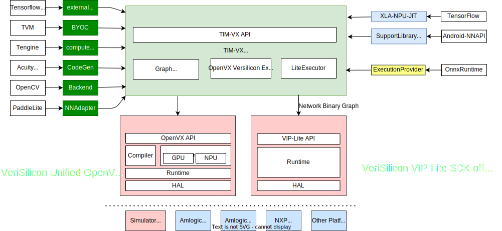

# TIM-VX - Tensor Interface Module
[](https://github.com/VeriSilicon/TIM-VX/actions/workflows/bazel_x86_vsim_unit_test.yml)
[](https://github.com/VeriSilicon/TIM-VX/actions/workflows/cmake_x86_vsim.yml)

- [TIM-VX - Tensor Interface Module](#tim-vx---tensor-interface-module)
  - [Framework Support](#framework-support)
  - [Architecture Overview](#architecture-overview)
  - [Technical documents](#technical-documents)
- [Get started](#get-started)
  - [Build and Run](#build-and-run)
    - [cmake](#cmake)
      - [Build with local google test source](#build-with-local-google-test-source)
      - [Build for evk-boards](#build-for-evk-boards)
      - [Important notice for integration](#important-notice-for-integration)
    - [Bazel](#bazel)
  - [Other](#other)
- [Reference board](#reference-board)
- [Support](#support)

TIM-VX is a software integration module provided by VeriSilicon to facilitate deployment of Neural-Networks on Verisilicon ML accelerators. It serves as the backend binding for runtime frameworks such as Android NN, Tensorflow-Lite, MLIR, TVM and more.

Main Features
 - Over [150 operators](https://github.com/VeriSilicon/TIM-VX/blob/main/src/tim/vx/ops/README.md) with rich format support for both quantized and floating point
 - Simplified C++ binding API calls to create Tensors and Operations [Guide](https://github.com/VeriSilicon/TIM-VX/blob/main/docs/Programming_Guide.md)
 - Dynamic graph construction with support for shape inference and layout inference
 - Built-in custom layer extensions
 - A set of utility functions for debugging

## Framework Support

- [Tensorflow-Lite](https://github.com/VeriSilicon/tflite-vx-delegate) (External Delegate)
- [Tengine](https://github.com/OAID/Tengine) (Official)
- [TVM](https://github.com/VeriSilicon/tvm) (Fork)
- [Paddle-Lite](https://github.com/PaddlePaddle/Paddle-Lite) (Official)
- [OpenCV](https://github.com/opencv/opencv/wiki/TIM-VX-Backend-For-Running-OpenCV-On-NPU) (Offical)
- MLIR Dialect (In development)

Feel free to raise a github issue if you wish to add TIM-VX for other frameworks.

## Architecture Overview




## Technical documents
*   [Add customized operator](docs/customized_op.md)
# Get started

## Build and Run

TIM-VX supports both [bazel](https://bazel.build) and [cmake](https://cmake.org).

----
### cmake

To build TIM-VX for x86 with prebuilt:

```shell
mkdir host_build
cd host_build
cmake ..
make -j8
make install
```

All install files (both headers and *.so) is located in : `host_build/install`

cmake options:

| option name | Summary | Default |
| ----- | ----- | ----- |
|`TIM_VX_ENABLE_TEST`| Enable unit test case for public APIs and ops | OFF |
|`TIM_VX_ENABLE_LAYOUT_INFER`| Build with tensor data layout inference support| ON |
|`TIM_VX_USE_EXTERNAL_OVXLIB`| Replace internal with a prebuilt libovxlib library | OFF |
|`OVXLIB_LIB`|full path to libovxlib.so include so name, required if `TIM_VX_USE_EXTERNAL_OVXLIB`=ON | Not set |
|`OVXLIB_INC`|ovxlib's include path, required if `TIM_VX_USE_EXTERNAL_OVXLIB`=ON| Not set |
|`EXTERNAL_VIV_SDK`| Give external vivante openvx driver libraries | Not set|
|`TIM_VX_BUILD_EXAMPLES`| Build example applications | OFF |
|`TIM_VX_ENABLE_40BIT` | Enable large memory (over 4G) support in NPU driver | OFF |
|`TIM_VX_ENABLE_PLATFORM` | Enable multi devices support | OFF |
|`TIM_VX_ENABLE_PLATFORM_LITE` | Enable lite multi-device support, only work when `TIM_VX_ENABLE_PLATFORM`=ON | OFF |
|`VIP_LITE_SDK` | full path to VIPLite sdk, required when `TIM_VX_ENABLE_PLATFORM_LITE`=ON | Not set |
|`TIM_VX_ENABLE_GRPC` | Enable gPRC support, only work when `TIM_VX_ENABLE_PLATFORM`=ON | OFF |
|`TIM_VX_DBG_ENABLE_TENSOR_HNDL` | Enable built-in tensor from handle | ON |
|`TIM_VX_ENABLE_TENSOR_CACHE` | Enable tensor cache for const tensor, check [OpenSSL build notes](docs/openssl_build.md) | OFF |

----
Run unit test:

```shell
cd host_build/src/tim

export LD_LIBRARY_PATH=`pwd`/../../../prebuilt-sdk/x86_64_linux/lib:<path to libgtest_main.so>:$LD_LIBRARY_PATH
export VIVANTE_SDK_DIR=`pwd`/../../../prebuilt-sdk/x86_64_linux/
export VSIMULATOR_CONFIG=<hardware name should get from chip vendor>
# if you want to debug wit gdb, please set
export DISABLE_IDE_DEBUG=1
./unit_test
```

#### Build with local google test source
```shell
    cd <wksp_root>
    git clone --depth 1 -b release-1.10.0 git@github.com:google/googletest.git

    cd <root_tim_vx>/build/
    cmake ../ -DTIM_VX_ENABLE_TEST=ON -DFETCHCONTENT_SOURCE_DIR_GOOGLETEST=<wksp_root/googletest> <add other cmake define here>
```

----
#### Build for evk-boards

1. prepare toolchain file follow cmake standard
2. make sure cross build low-level driver with toolchain separately, we need the sdk from the low-level driver
3. add ```-DEXTERNAL_VIV_SDK=<low-level-driver/out/sdk>``` to cmake definitions, also remember ```-DCMAKE_TOOLCHAIN_FILE=<Toolchain_Config>```
4. or for using a buildroot toolchain with extrnal VIV-SDK add:
   ```cmake
   -DCONFIG=BUILDROOT -DCMAKE_SYSROOT=${CMAKE_SYSROOT} -DEXTERNAL_VIV_SDK=${BUILDROOT_SYSROOT}
   ```
5. then make

----
#### Important notice for integration
If you want to build tim-vx as a static library, and link it to your shared library or application, please be carefull with the linker, "-Wl,--whole-archive" is required.

@see **samples/lenet/CMakeLists.txt** for reference

### Bazel

[Install bazel](https://docs.bazel.build/versions/master/install.html) to get started.

TIM-VX needs to be compiled and linked against VeriSilicon OpenVX SDK which provides related header files and pre-compiled libraries. A default linux-x86_64 SDK is provided which contains the simulation environment on PC. Platform specific SDKs can be obtained from respective SoC vendors.

To build TIM-VX:

```shell
bazel build libtim-vx.so
```

To run sample LeNet:

```shell
# set VIVANTE_SDK_DIR for runtime compilation environment
export VIVANTE_SDK_DIR=`pwd`/prebuilt-sdk/x86_64_linux

bazel build //samples/lenet:lenet_asymu8_cc
bazel run //samples/lenet:lenet_asymu8_cc
```

## Other

To build and run Tensorflow-Lite with TIM-VX, please see [README](https://github.com/VeriSilicon/tflite-vx-delegate#readme)

To build and run TVM with TIM-VX, please see [TVM README](https://github.com/VeriSilicon/tvm/blob/vsi_npu/README.VSI.md)

# Reference board

Chip | Vendor | References | Success Stories |
:------    |:----- |:------ |:------
i.MX 8M Plus | NXP | [ML Guide](https://www.nxp.com.cn/docs/en/user-guide/IMX-MACHINE-LEARNING-UG.pdf), [BSP](https://www.nxp.com/design/software/embedded-software/i-mx-software/embedded-linux-for-i-mx-applications-processors:IMXLINUX?tab=Design_Tools_Tab) | [SageMaker with 8MP](https://docs.aws.amazon.com/sagemaker/latest/dg/neo-supported-devices-edge.html)
A311D | Khadas - VIM3 | [A311D datasheet](https://dl.khadas.com/Hardware/VIM3/Datasheet/A311D_Quick_Reference_Manual_01_Wesion.pdf), [BSP](https://dl.khadas.com/Firmware/VIM3/Ubuntu/EMMC/VIM3_Ubuntu-server-focal_Linux-4.9_arm64_EMMC_V0.9-20200530.7z) | [Paddle-lite demo](https://github.com/PaddlePaddle/Paddle-Lite/blob/develop/docs/demo_guides/verisilicon_timvx.md)
S905D3 | Khadas - VIM3L | [S905D3](https://dl.khadas.com/Hardware/VIM3/Datasheet/S905D3_datasheet_0.2_Wesion.pdf) , [BSP](https://dl.khadas.com/Firmware/VIM3L/Ubuntu/EMMC/VIM3L_Ubuntu-server-focal_Linux-4.9_arm64_EMMC_V0.9-20200530.7z)

# Support
Create issue on github or email to ML_Support at verisilicon dot com
