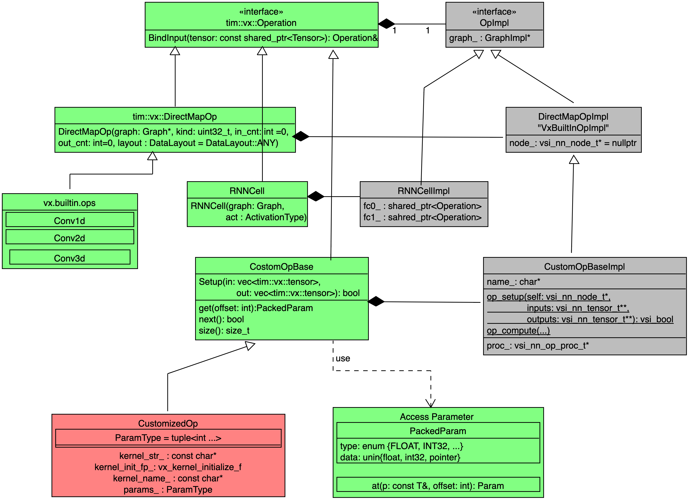

- [Extend tim-vx with customized operator](#extend-tim-vx-with-customized-operator)
- [User stories](#user-stories)
- [Design overview](#design-overview)
  - [**Composed operator**](#composed-operator)
    - [Layout Inference {todo}](#layout-inference-todo)
  - [**Customized opencl operator**](#customized-opencl-operator)
    - [How to determine parameter list in a tuple](#how-to-determine-parameter-list-in-a-tuple)
    - [How to config global_work_size and local_work_size](#how-to-config-global_work_size-and-local_work_size)
    - [Layout Inference {todo}](#layout-inference-todo-1)

# Extend tim-vx with customized operator

tim-vx will provide two different approches supporting extend AI operators besides built-in ops.
  
  * Compose new operation with builtin ops. example: RNNCell
  * Register  opencl kernel as customized operator

# User stories
As **application developer**, I want to **be able to create new opeartor with built-in ops**, so that I can **simplify the lowing from high-level framework(tensorflow,pytorch) to tim-vx**, since I don't want to rewrite same pattern in different frameworks.

As **application developer**, I want to **be able to create my own opeartor with standard opencl kernel**, so that I can **support novel operators not presented in tim-vx**.

# Design overview


* Green components implemented as a public API of tim-vx.
* Red components could be implemented outside of tim-vx.
* Gray components implemented as a private code inside tim-vx.

## **Composed operator**

If some operator can be composed by built-in operators, such as RNNCell which actually built from FullyConnected, Tanh, and DataConvert Layers,
developer can add their own operator implementation before VSI introduce high-performance built-in ops.

[Implementation reference of RNNCell](https://github.com/VeriSilicon/TIM-VX/blob/main/src/tim/vx/ops/rnn_cell.cc)

**Keynotes for RNNCell**:

In the constructor of RNNCellImpl, internal operators - fc/tanh/dataconvert - will be created without inner connection.
The inner connection build up inside bindInput() and bindOutput();

### Layout Inference {todo}

Inside of composed operator, it actually is a subgraph of tim-vx's built-in operatos, it should be easy to extend the original layout inference for build-in operators to composed operator - just do layout inference inside the subgraph.

```c++
void ComposedOp::OnInputs(std::vector<std::shared_ptr<vx::Tensor> next_tensor) {
    for(auto op: op_->OpsInSubgraph()) {
        auto Cloned = handleLayoutInference(new_graph, op);
    }
}
```

## **Customized opencl operator**

Customzied kernel should implemented with standard OpenCL 2.0; With tim-vx built-in infrastructure, user can inject their operator with :

1. OpenCL kernel stream as source code;
2. Kernel enqueue configuration for global_work_size and local_work_size;
3. Scalar parameter list defined as a std::tuple;
3. Readable operator name;

TIM-VX provide two different approach to integrate user's operator:
1. Build from source : build tim-vx source and user operators' implementation as single library;
2. Build from sdk: tim-vx prebuilt as a standalone library and a set of standard headers; user build operator implementation and link with tim-vx;

From tim-vx api view, the customized operator registed at graph-level, the registration automatically effected at the first time to create instance of the customized operator. With this approcah, user can override built-in operator or support new operator in a new model easily.

```c++
void CreateGraphWithCustomizedOperator() {
    // create context/graph/tensor as before.
    auto conv = graph->CreateOperation<tim::vx::Conv2d>(...);
    auto post_detect = graph->CreateOperation<3rd_party::DetectionPostProcess>(...);
    post_detect.BindInput(...);
    post_detect.BindOutput(...);
    
    graph->Compile();
}
```

### How to determine parameter list in a tuple
Usually, kernel take two different kinds of paramter: "tensor-like" and scalar; The tensor-like parameters usually is the output-tensor from other operators or input for other operator. 
In the operator's paramter list, only scalar parameters should be defined. "tensor-like" operand should provied by bindInput/bindOutput. 

The scalar paramters **MUST** provided at kernel registration.

Take following hswish as example:
CL kernel signature:
```cl
__kernel void hswish_F32toF32(
    __read_only  image2d_array_t  input,
    __write_only image2d_array_t  output,
                 float            inputScale,
                 float            inputTail,
                 float            outputScale,
                 float            outputZP)
```

C++ paramter list defined by user
```c++
namespace user {
   class customized_hswish : public tim::vx::CustomizeOpBase {
    using param_types = std::tuple<float/*inputScale*/, float/*inputTail*/, float/*outputScale*/, float/*outputZP*/>;
    customized_hswish(std::shared_ptr<tim::vx::Graph> g, const param_types& params/* any other parameter required by c++ code, not relevant to cl kernel*/) {
    }

    auto clone(std::shared_ptr<tim::vx::Graph> g) {
        return g->CreateOperation<user::customized_hswish>(g, this->params/*others*/);
    }
   };
}
```
### How to config global_work_size and local_work_size

Similar feature as **clEnqueueNDRangeKernel** in standard OpenCL;

Some tips for work_size:
    HWThreadCount = 4

### Layout Inference {todo}
so far we don't support this feature. User should take care of the layout transform carefully.
TODO: vsi will rework the framework so that any customized op can work properly in layout transform.